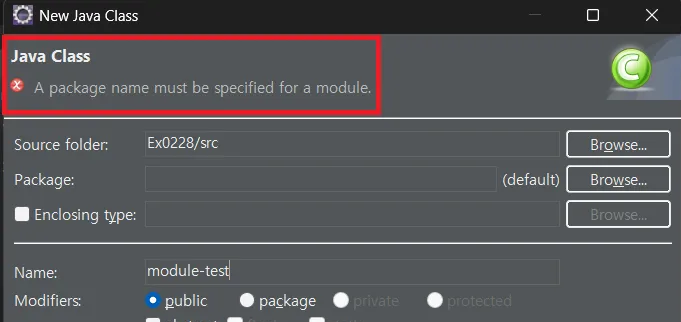

Java의 모듈시스템에 대해서 알아보자

<!--more-->

클래스를 생성하려고 하자마자 A package name must be specified for module. 라고 뜨는게 아닌가..?

<br>



<br>

번역해 보자면, **패키지 명의 모듈을 위해서 지정되어야 한다.** 라고하는데

Package에 뻔히 default라고 되어있을뿐만 아니라, 그 동안 무수하게 많은 클래스들을 defualt 패키지에 만들어왔었는데 갑자기 안된다고 하니까 자바의 억까가 벌써부터 시작이구나 하는걸 느꼈다.

<br>

승환쌤께서는 `module-info.java`가 해당 문제의 원인이라고 하셨다.

답을 듣고나니 얘가 어떤 원리로 감히 class 생성을 막는가..? 라는 생각이 들더라.

그래서 G선생을 통해서 추가적인 답변을 구해보았다.

<br>

### 🔍 **오류 발생 원인**

`module-info.java`는 Java 9에서 도입된 **모듈 시스템**(JPMS, Java Platform Module System)의 일부로, 프로젝트가 **명확한 모듈 구조를 가지도록 강제**하는 역할을 합니다.

이 파일이 존재하면 **모듈화된 프로젝트**로 인식되며, 몇 가지 중요한 제약 사항이 생깁니다. 이 때문에 `module-info.java`가 있는 프로젝트에서 패키지 선언이 올바르게 되어 있지 않으면 `A package name must be specified for a module.` 같은 오류가 발생할 수 있습니다.

<br>

자바의 모듈 시스템 때문에 문제가 발생했다고 한다.
기존의 자바는 모듈 시스템이 아니라 Class를 중심으로 한 Classpath를 사용을 했기 때문에, default 패키지여도 해당 경로를 인식을 할 수 있었으나, 모듈 시스템이 도입이 되면서 package를 중심으로 조금 더 대규모 애플리케이션구축에 효율적이면서 보안이 중요한 프로젝트를 만들기 위해서 Modulpath를 강제하게 되었다고 보면 되겠다.

<br>

**Classpath의 문제점**

**1. JAR Hell 문제발생**

-   컴파일 시에 경로를 순차적으로 탐색하기 때문에, 같은 패키지 내에 있는 클래스가 여러 개 있을 경우 충돌거나 원하지 않는 클래스를 return할 가능성이 높다.

<br>

**2. 캡슐화 불가능하며 접근 제어가 약함**

-   Java의 public 키워드는 Classpath기반에서는 완전히 공개되기 때문에, 개발자가 원하지 않는 클래스도 모든 곳에서 사용될 수 있음.

<br>

**3. Classpath는 실행 시간이 길어질 수 있음**

-   Classpath는 실행될 때 해당하는 클래스가 어디에 있는지 전부 찾아야 함.
-   즉, Classpath에 포함된 모든 JAR 파일을 뒤져야 해서 속도가 느려질 수 있음.

<br>

그러면 모듈 시스템은 어떻게 사용을 할 수 있는가?
modulepath를 쓰면서 다른 패키지들과 상호작용하려면 **어떤 패키지를 공개할지 명시적으로 선언**해야 한다.

<br>

**직접 명시 ( export ) 를 해보자!**

첫째, 먼저 modul-info.java에 운영하고자하는 패키지를 exports한다.

```java
module my.module {
    exports com.example.mypackage;
}
```

<br>

둘째, `com.example.mypackage` 안에 있는 모든 클래스는 패키지 선언을 해주면 끝이다.

```java
package com.example.mypackage;

public class MyClass {
    // 클래스 내용
}
```

<br>

끝이다. 너무 간단하지 않는가?
프로젝트시에 module-info를 활용해서 개발을 한번 해보자!

개념을 보니 Spring Boot의 의존성 주입이나, Java project의 maven, gradle의 구조와 비슷한거 같다.

앞으로 교육을 받아보면서 해당 내용들을 한번 잘 정리를 해봐야겠다.

<br>

그렇다면 또 반대로 모듈 시스템을 사용하는 JAVA 버전에서는 default를 사용 할 수없는가?

<br>

댓츠 논노 그렇지않다.

<br>

바로 처음 승환쌤이 말씀해주신거 처럼 modul-info를 삭제하는 방법이다.

<br>

앗 그러면 많은 문제가 발생하지 않느냐..??  
할 수 있지만, 지금 당장은 대규모로 클래스와 모듈을 만들 상황이 없기에 과감하게 삭제를 해보자!
